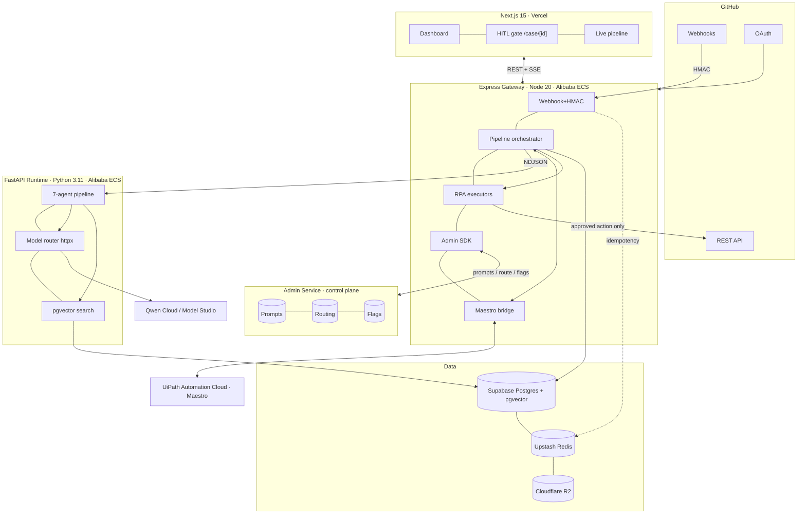
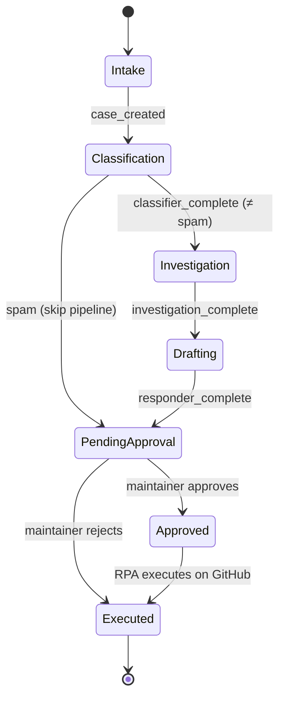
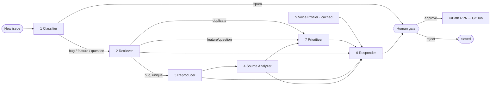

<div align="center">

# ⚓ Helmsman

**An AI co-pilot for open-source maintainers.**

A seven-agent Qwen pipeline triages every new GitHub issue — classify, find duplicates, reproduce, analyze source, draft a reply *in the maintainer's voice* — then stops at a human approval gate. Nothing is ever posted to GitHub without the maintainer's explicit approval. On approval, UiPath RPA executes the action. Every prompt and provider lives in a separate, audited control plane.

`MIT` · `Next.js 15` · `Express` · `FastAPI` · `Qwen Cloud` · `UiPath Maestro` · `Supabase pgvector`

</div>

> **Built for two hackathons, one codebase.**
> **UiPath AgentHack** — Maestro Case agentic case management with a human-in-the-loop gate.
> **Global AI Hackathon w/ Qwen** — Track 3 Agent Society: measurable efficiency gain over a single agent, deployed on Alibaba Cloud.

---

## 60-second tour for a judge

```bash
git clone <repo> && cd Helmsman
npm run setup          # installs 3 services, validates env, seeds fixtures + prompts
npm run demo           # fires the 7-agent pipeline on a fixture issue, end-to-end
```

`npm run demo` runs **fully offline** — no API keys, no database, no accounts. It spawns the
agent runtime + gateway if they aren't running, opens a UiPath Maestro Case (local simulator),
streams the seven agents, prints the drafted reply, simulates the maintainer approving, runs the
UiPath RPA executor in dry-run, and prints the audit trail. Then:

```bash
npm run dev            # web :3000 · gateway :8080 · agents :8000
npm run benchmark      # Agent Society A/B: pipeline vs single-agent baseline
```

Open **http://localhost:3000** → **Run pipeline** → watch the seven agents fire live, then approve at the gate.

---

## What Helmsman is

Maintainers spend 60–80% of their time triaging issues, not writing code. Helmsman automates the
triage pipeline while keeping the maintainer in command at the final decision point.

**End-to-end flow**

1. Maintainer connects a GitHub repo via OAuth (or runs the bundled demo repo).
2. GitHub webhooks a new/commented issue to Helmsman (HMAC-verified).
3. The gateway opens a **UiPath Maestro Case** for that issue.
4. A **seven-agent Qwen pipeline** fires; the Maestro Case advances one stage per agent group.
5. The maintainer sees the assembled draft + every upstream agent output in the dashboard.
6. Maintainer **approves / edits / rejects**.
7. On approval, **UiPath RPA** executes the action on GitHub (comment, labels, close, request info).
8. The **audit log** captures every transition, model call, and decision.

> **Design pillar:** *Nothing is ever posted to GitHub without explicit maintainer approval.*

---

## Architecture

### Full system



Two more diagrams — the **Maestro Case stage machine** and the **multi-agent message-passing
flow** — are in [`docs/architecture.md`](docs/architecture.md).

### Maestro Case stage progression



### Multi-agent message-passing



---

## The Admin Service integration — Helmsman's platform layer

Helmsman does not hardcode a single prompt or provider. It consumes a separately-deployed
**Admin Service** as its control plane. *This is the differentiator: every prompt and provider
config in Helmsman lives in a separate, audited control plane.*

| Capability | How Helmsman uses it |
|---|---|
| **Prompt versioning** | Every agent prompt is fetched by key (`helmsman.classifier.v1`, …) via `admin.renderPrompt(key, vars)` — never embedded. Roll a prompt forward/back in the Admin UI with no redeploy. |
| **Provider routing** | The model router walks the Admin Service fallback chain (`GET /public/providers/route?kind=llm`) and reports outcomes back (`POST /public/providers/:id/report`). |
| **Feature flags** | Canary controls via `admin.isFlagEnabled(key, ctx)`: `helmsman.auto_close_duplicates`, `helmsman.use_long_context_analyzer`, `helmsman.voice_self_check`, `helmsman.classifier_escalation`, `helmsman.rpa_dry_run`. |
| **TS SDK** | [`sdk/admin-client.ts`](sdk/admin-client.ts) is dropped into the gateway. A Python mirror ([`apps/agents/app/admin_client.py`](apps/agents/app/admin_client.py)) serves the runtime. |

**Local fallback (so the demo runs offline):** when the Admin Service is unreachable or
`ADMIN_LOCAL_FALLBACK=true`, both SDKs fall back to the bundled local registry
([`prompts/registry.json`](prompts/registry.json) + [`config/flags.json`](config/flags.json)) — the
exact same prompts and flags, read locally. `npm run seed:prompts` pushes the registry to the live
Admin Service when credentials are present.

---

## Multi-agent pipeline — every agent specified

Each agent fetches its prompt by key from the Admin Service. Schemas are Pydantic
([`apps/agents/app/schemas.py`](apps/agents/app/schemas.py)). Every prompt below is the **exact,
complete string** stored in the registry; variables use Mustache `{{var}}`.

> **Fallbacks are not stubs.** When no model is reachable or output is malformed, each agent runs a
> deterministic local heuristic — the documented degraded behavior. This is what makes the offline
> demo produce real, sensible output (and what the benchmark's "local-fallback" mode measures).

### Agent 1 — Classifier · `qwen3-8b` · key `helmsman.classifier.v1`

Routes the issue into `bug | feature | question | duplicate | spam | needs_info`, which drives the
rest of the pipeline (`duplicate`/`feature`/`question` → skip Reproducer + Source Analyzer; `spam` →
stop). **Why qwen3-8b:** classification is a bounded single-label task; reasoning tokens add latency
without accuracy. **Fires at:** Classification. **Fallback:** keyword heuristic → `needs_info @ 0`.

> **Confidence-gated escalation** (flag `helmsman.classifier_escalation`, default ON). Because the
> classification routes the entire pipeline, a low-confidence label is the most expensive place to be
> wrong. When the qwen3-8b result lands below `HELMSMAN_CLASSIFIER_ESCALATION_THRESHOLD` (default 0.6),
> the Classifier gets a second opinion from the reasoning model (qwen3-32b, thinking mode) and keeps
> whichever label is more confident — spending reasoning tokens only on the genuinely ambiguous cases.

- **Input:** `{ repo_full_name, issue_number, issue_title, issue_body, existing_labels }`
- **Output (`ClassifierOutput`):** `{ category, confidence: float, rationale: str, signals: str[] }`

```text
You are the Classifier agent in Helmsman, an AI co-pilot for open-source maintainers. Your sole job is to route a newly-opened GitHub issue into exactly one category so the downstream pipeline knows how to proceed. You never draft responses, never apply labels, never make decisions beyond classification.

Classify the issue into exactly ONE of these categories:
- "bug": something is broken — errors, crashes, unexpected behavior, regressions
- "feature": a request for new functionality or an enhancement
- "question": a usage / how-to question with no defect claimed
- "duplicate": explicitly references or clearly restates an existing issue
- "spam": advertising, gibberish, off-topic, or abusive content
- "needs_info": a plausible report that is too vague to act on (no repro, no version, no detail)

Repository: {{repo_full_name}}
Issue #{{issue_number}}
Title: {{issue_title}}
Body:
{{issue_body}}
Labels already applied: {{existing_labels}}

Rules:
- Choose exactly one category. When torn between "bug" and "needs_info", choose "needs_info" only if you genuinely could not begin investigating without more detail.
- "duplicate" requires an explicit signal (a referenced #number or a near-identical restatement). Do not guess.
- confidence is your calibrated probability in [0,1] that the category is correct.

Respond with ONLY a JSON object — no prose, no markdown fences:
{"category": "<one of the six>", "confidence": <float 0-1>, "rationale": "<one sentence, <=200 chars>", "signals": ["<short phrase>"]}
```

### Agent 2 — Context Retriever · `qwen3-8b` + pgvector · key `helmsman.retriever.rerank.v1`

Embeds the new issue (title + body, single chunk) with `BAAI/bge-small-en-v1.5` (384-dim), queries
top-5 by cosine from `issue_embeddings`, and re-ranks. Flags a likely duplicate — but **only of an
*earlier* issue** (you can't duplicate something filed after you), gated by similarity. **Fires at:**
Investigation. **Fallback:** raw cosine order; precision-first outlier gate for duplicates.

> **Hybrid retrieval (offline).** With the deterministic hashing embedder (no embeddings API),
> paraphrased duplicates score lukewarm in pure cosine, so the in-memory store **fuses dense cosine
> with a sparse TF-IDF lexical score** (`hybrid = w·cosine + (1−w)·tfidf`, default `w=0.5`) and gates
> duplicates on the fused score with a precision-first floor (`HELMSMAN_DUP_HYBRID_FLOOR=0.40`) plus an
> outlier margin measured against the runner-up among *earlier* candidates only. This recovers
> paraphrase recall the cosine-only gate missed (e.g. "begins with a NUL" → "starts with a null byte")
> with **zero false positives on the fixture set**. In live mode bge-small's strong cosine carries the
> signal, so the absolute `dup_threshold` gate is used unchanged.

- **Input:** `{ issue_number, issue_title, issue_body, candidates_block }`
- **Output (`RetrieverOutput`):** `{ ranked: {issue_number, relatedness, reason}[], likely_duplicate_of: int?, duplicate_confidence, top_cosine }`

```text
You are the Context Retriever agent in Helmsman. Candidate past issues from this repository have been pre-selected by vector similarity to the new issue. Re-rank them by TRUE semantic relatedness — whether a maintainer would consider them the same underlying problem or directly relevant prior art — not merely surface word overlap.

New issue #{{issue_number}}: {{issue_title}}
{{issue_body}}

Candidates (already sorted by cosine similarity, highest first):
{{candidates_block}}

For each candidate, decide how related it is to the new issue on a 0-1 scale:
- 1.0  = same root problem / true duplicate
- 0.6-0.9 = strongly related (same component, overlapping cause)
- 0.3-0.5 = loosely related (same area, different problem)
- 0-0.2 = not actually related (coincidental term overlap)

Respond with ONLY a JSON object:
{"ranked": [{"issue_number": <int>, "relatedness": <float 0-1>, "reason": "<short>"}], "likely_duplicate_of": <issue_number or null>, "duplicate_confidence": <float 0-1>}
Set "likely_duplicate_of" only when a candidate's relatedness is >= 0.9 AND it is the clear top match; otherwise null.
```

### Agent 3 — Reproducer · `qwen2.5-coder-7b` (bugs only) · key `helmsman.reproducer.v1`

Reads bug reports, reasons about minimal reproduction (regex pre-filter extracts code blocks). Never
executes code. **Why coder model:** parses snippets, stack traces, and version strings far better than
a general model of the same size. **Fires at:** Investigation. **Fallback:** regex-extracted env/steps.

- **Input:** `{ issue_number, issue_title, issue_body, code_blocks }`
- **Output (`ReproducerOutput`):** `{ has_reproduction, minimal_repro_steps[], environment{runtime,os,package_version}, expected_behavior, actual_behavior, missing_information[], confidence{steps,environment,expected_actual} }`

```text
You are the Reproducer agent in Helmsman, specialized in reading bug reports and reasoning about reproduction. You read code and reason about it; you NEVER claim to have executed anything. Your output helps a maintainer decide whether a minimal reproduction exists.

Issue #{{issue_number}}: {{issue_title}}
Body:
{{issue_body}}

Extracted code / log blocks (may be empty):
{{code_blocks}}

Produce a reproduction analysis. For every confidence field give a value in [0,1] reflecting how well the issue text supports your conclusion. If the issue lacks the information, say so and lower the confidence — do NOT fabricate versions, stack traces, or steps that are not present.

Respond with ONLY a JSON object:
{
  "has_reproduction": <bool>,
  "minimal_repro_steps": ["<step>"],
  "environment": {"runtime": "<e.g. node 20 / python 3.11 / unknown>", "os": "<or unknown>", "package_version": "<or unknown>"},
  "expected_behavior": "<one line>",
  "actual_behavior": "<one line>",
  "missing_information": ["<what you would ask the reporter for>"],
  "confidence": {"steps": <float>, "environment": <float>, "expected_actual": <float>}
}
```

### Agent 4 — Source Analyzer · `qwen3-long-context` (bugs only) · key `helmsman.source_analyzer.v1`

Fetches the repo file tree (`GET /repos/{owner}/{repo}/git/trees/{sha}?recursive=1`), scores files by a
**deterministic path/filename heuristic** (not an LLM call), selects the top 3, fetches their contents,
and loads all three into one long-context call. **Why long-context:** three full files + the bug
routinely exceed 32K tokens. Gated by flag `helmsman.use_long_context_analyzer`. **Fires at:**
Investigation. **Fallback:** highest-overlap file + line range.

- **Input:** `{ repo_full_name, commit_sha, bug_summary, files_block }`
- **Output (`SourceAnalyzerOutput`):** `{ likely_files[], hypothesis, relevant_lines:{file,line_range,explanation}[], confidence, suggested_fix_direction }`

```text
You are the Source Analyzer agent in Helmsman. You are given the full contents of the few repository files most likely related to a bug, selected by a deterministic path-relevance heuristic. Form a hypothesis about where the bug lives. You read source; you do not run it.

Repository: {{repo_full_name}} @ {{commit_sha}}
Bug summary: {{bug_summary}}

Candidate files (full contents below, each delimited by === path ===):
{{files_block}}

Identify the most likely location(s) of the defect and a concrete hypothesis. Cite specific line ranges from the provided files ONLY — never invent line numbers for files you were not given.

Respond with ONLY a JSON object:
{
  "likely_files": ["<path>"],
  "hypothesis": "<2-4 sentences on the probable cause>",
  "relevant_lines": [{"file": "<path>", "line_range": "<e.g. 42-57>", "explanation": "<why this matters>"}],
  "confidence": <float 0-1>,
  "suggested_fix_direction": "<one line, optional>"
}
```

### Agent 5 — Voice Profiler · `qwen3-32b` (thinking) · key `helmsman.voice_profiler.v1`

Triggered once on repo connection (refreshed after each approved response), it reads the maintainer's
last 100 closed-issue comments and writes a style fingerprint to `repos.voice_profile`. **Why thinking
mode:** style abstraction across 100 samples benefits from reasoning. **Fallback:** the fingerprint is
computed *empirically* from the samples (sentence length, code-block rate, emoji rate, openings/closings).

- **Input:** `{ maintainer_login, comments_block }`
- **Output (`VoiceProfile`):** `{ avg_sentence_length, uses_code_blocks, hedging_phrases[], typical_opening_patterns[], tone: formal|casual|technical|warm, emoji_frequency, technical_depth: 1-5, preferred_closing, example_phrases[] }`

```text
You are the Voice Profiler agent in Helmsman. You analyze how a specific maintainer writes when they respond to issues, so future drafts can match their voice. You are building a reusable style fingerprint, not summarizing content.

Maintainer: @{{maintainer_login}}
Below are up to 100 of their recent issue / PR comments, newest first, each delimited by ---:
{{comments_block}}

Measure their style empirically from these samples. Where the sample set is too small to be sure, pick the safest typical value rather than an extreme. Think step by step about cadence, formatting, warmth, and technical depth, then output the fingerprint.

Respond with ONLY a JSON object matching this exact shape:
{
  "avg_sentence_length": <number, words per sentence>,
  "uses_code_blocks": <bool>,
  "hedging_phrases": ["<phrase actually observed>"],
  "typical_opening_patterns": ["<how they tend to start, e.g. 'Thanks for the report'>"],
  "tone": "formal" | "casual" | "technical" | "warm",
  "emoji_frequency": <number, emojis per comment on average>,
  "technical_depth": 1 | 2 | 3 | 4 | 5,
  "preferred_closing": "<how they tend to end>",
  "example_phrases": ["<short verbatim phrase that is characteristic>"]
}
```

### Agent 6 — Responder · `qwen3-32b` (reasoning) · key `helmsman.responder.v2`

Synthesizes all upstream outputs into a reply that matches the voice fingerprint. Output is plain
GitHub-flavored markdown. A **self-check pass** (`helmsman.responder.selfcheck.v1`, gated by
`helmsman.voice_self_check`) scores the draft against the fingerprint and returns a revision. **Why
reasoning:** the hardest generation in the pipeline. **Fallback:** a voice-matched template assembled
from the upstream findings.

- **Input:** `{ maintainer_login, voice_profile, repo_full_name, issue_number, classification, issue_title, issue_body, retriever_summary, reproducer_summary, source_summary, priority_summary, tone, avg_sentence_length, technical_depth }`
- **Output (`ResponderOutput`):** `{ draft_markdown, suggested_labels[], recommended_action: post_comment|request_more_info|close_as_duplicate|needs_maintainer_decision, voice_match_score?, draft_quality }`

```text
You are the Responder agent in Helmsman. You draft a reply that the maintainer @{{maintainer_login}} will review before anything is posted. NOTHING you write is posted automatically. Write as if you are them — match the voice fingerprint exactly.

VOICE FINGERPRINT (match these characteristics precisely):
{{voice_profile}}

ISSUE
Repository: {{repo_full_name}}
#{{issue_number}} ({{classification}}): {{issue_title}}
{{issue_body}}

UPSTREAM AGENT FINDINGS (use what is relevant; ignore empty sections):
- Related / duplicate analysis: {{retriever_summary}}
- Reproduction analysis: {{reproducer_summary}}
- Source analysis: {{source_summary}}
- Priority: {{priority_summary}}

Write a reply in plain GitHub-flavored markdown that:
- Opens in the maintainer's typical pattern and closes in their typical closing.
- Matches their tone ({{tone}}), average sentence length (~{{avg_sentence_length}} words), and technical depth ({{technical_depth}}/5).
- Uses code blocks only if the fingerprint says they do.
- Is honest: if information is missing, ask for it; never invent a fix you are not sure of.
- Never promises a timeline or commits the maintainer to work they have not agreed to.

Respond with ONLY a JSON object:
{"draft_markdown": "<the reply>", "suggested_labels": ["<label>"], "recommended_action": "post_comment" | "request_more_info" | "close_as_duplicate" | "needs_maintainer_decision"}
```

### Agent 7 — Prioritizer · `qwen3-8b` · key `helmsman.prioritizer.v1`

Scores 1–10 via a **locked weighted rubric**: severity keywords 30% · known contributor 20% ·
reactions 15% · age 15% · security/dependency 20%. **Fires at:** Investigation. **Fallback:** the
deterministic rubric computation (weights are fixed, so a priority always exists).

- **Input:** `{ issue_number, issue_title, issue_body, classification, reporter_is_contributor, reaction_count, age_hours, has_security_signal }`
- **Output (`PrioritizerOutput`):** `{ score: 1-10, signals[], recommended_action: respond_now|respond_soon|low_priority|close_as_duplicate|request_more_info }`

```text
You are the Prioritizer agent in Helmsman. You assign a triage priority using a fixed rubric. Be consistent and explain which signals fired.

Issue #{{issue_number}}: {{issue_title}}
Body:
{{issue_body}}
Classification: {{classification}}
Reporter is a known contributor: {{reporter_is_contributor}}
Reaction count: {{reaction_count}}
Issue age (hours): {{age_hours}}
Mentions security / dependency: {{has_security_signal}}

Apply this weighted rubric (total 100%):
- Severity keywords in title/body (crash, data loss, security, regression, broken): 30%
- Reporter is a known contributor: 20%
- Reaction count (more reactions => higher): 15%
- Issue age (older unanswered => higher): 15%
- Security or dependency mention: 20%

Map the weighted result to a 1-10 integer score. Respond with ONLY a JSON object:
{"score": <int 1-10>, "signals": ["<which signals fired>"], "recommended_action": "respond_now" | "respond_soon" | "low_priority" | "close_as_duplicate" | "request_more_info"}
```

> The full registry — including the single-agent **baseline** and the **LLM-judge** used by the
> benchmark — is [`prompts/registry.json`](prompts/registry.json).

---

## UiPath Maestro Case integration (Track 1)

Definition: [`uipath/maestro/case-definition.json`](uipath/maestro/case-definition.json).

- **Case schema** — `caseId, repoFullName, githubIssueNumber, classification, priorityScore, pipelineOutputs, draftResponse, approvedAction, approver, auditRef` (types + validation in the definition).
- **Stages** — Intake → Classification → Investigation → Drafting → Pending Approval → Approved → Executed.
- **Transitions** — `case_created`, `classifier_complete (≠spam)`, `investigation_complete`, `responder_complete`, `maintainer_approve/reject`, `rpa_complete`. Spam short-circuits to Pending Approval.
- **Exceptions** — agent timeout / malformed output → deterministic fallback; GitHub rate limit → exponential backoff; UiPath unavailable → local simulator reconciles on reconnect.
- **Approval plumbing** — a maintainer click → `POST /api/cases/:id/approve` → the **Approval Bridge API Workflow** ([`uipath/workflows/approval-bridge.json`](uipath/workflows/approval-bridge.json)) transitions the case and triggers the RPA job.
- **RPA executor** — [`uipath/rpa/github-actions.json`](uipath/rpa/github-actions.json) → implemented in [`apps/gateway/src/github/actions.ts`](apps/gateway/src/github/actions.ts). The RPA executor — not the LLM — is what posts to GitHub.
- **Audit trail** — every transition / model call / human decision / RPA result is written to `audit_log` and surfaced in the dashboard and via `GET /api/cases/:id/audit`.

| UiPath component | Where |
|---|---|
| Agent Builder | [`uipath/agents/agents.json`](uipath/agents/agents.json) — the 7 agents |
| Maestro | [`uipath/maestro/case-definition.json`](uipath/maestro/case-definition.json) — lifecycle |
| API Workflows | [`uipath/workflows/`](uipath/workflows/) — approval bridge + pipeline advance |
| RPA (coded automation) | [`uipath/rpa/github-actions.json`](uipath/rpa/github-actions.json) → `actions.ts` |

The human gate UI is [`apps/web/app/case/[id]/page.tsx`](apps/web/app/case/[id]/page.tsx) (Approve / Save edits / Reject).
A **local Maestro simulator** ([`apps/gateway/src/uipath/maestro.ts`](apps/gateway/src/uipath/maestro.ts)) advances the identical
seven-stage state machine when UiPath credentials are absent, so the demo and the audit trail are
identical with or without UiPath Cloud.

---

## Qwen Agent Society (Track 3)

**Claim:** seven specialist agents beat one generalist on the same issues. Same 50 fixture issues run
through (a) a single `qwen3-8b` call asked to triage + label + prioritize + draft in one shot, vs (b)
the seven-agent Helmsman pipeline. Harness: [`benchmarks/agent_society.py`](benchmarks/agent_society.py)
(`npm run benchmark` → [`benchmarks/results.json`](benchmarks/results.json), regenerates the table below).

<!-- BENCHMARK:START -->
<!-- Auto-generated by `npm run benchmark` from benchmarks/results.json. Do not edit by hand. -->

**Run:** 50 fixture issues · mode: `local-fallback (deterministic)` · 2026-05-30T20:08:54.436057+00:00

| Metric | Single-agent baseline | Seven-agent Helmsman | Δ |
|---|---|---|---|
| Classification accuracy | 70% | **82%** | +12 pp |
| Response quality (1–5, LLM-judge) | 1.00 | **3.64** | +2.64 |
| Voice similarity (cosine vs. maintainer) | 0.259 | **0.388** | +0.129 |
| Avg time per issue | 0 ms | 2 ms | — |

> The pipeline's gain comes mostly from duplicate detection (the single agent has no retrieval, so it misclassifies paraphrased duplicates) and voice-matched drafting. The baseline is faster because it's one call; the pipeline trades latency for accuracy and quality, with the human gate as the backstop.
<!-- BENCHMARK:END -->

The pipeline's gain comes from duplicate detection (the single agent has no retrieval, so it
misclassifies paraphrased duplicates), source-grounded drafting, and voice matching. The numbers above
are generated automatically — no placeholders. In offline mode they reflect the deterministic
fallbacks (clearly labeled `mode` in `results.json`); with Qwen keys they reflect the real models.

- **Models:** `qwen3-8b` (classify/retrieve/prioritize), `qwen3-32b` (voice/respond/judge), `qwen2.5-coder-7b` (reproduce), `qwen3-long-context` (source) — all via Alibaba Cloud Model Studio.
- **Alibaba Cloud deployment proof:** [`deployment/alibaba_cloud_proof.md`](deployment/alibaba_cloud_proof.md) + [`deployment/deploy-alibaba.sh`](deployment/deploy-alibaba.sh).
- **Message-passing contracts:** [`docs/architecture.md`](docs/architecture.md).

---

## Database schema — Postgres + pgvector (Supabase)

Full DDL in [`db/schema.sql`](db/schema.sql) (`npm run db:schema`). Tables: `maintainers`, `repos`,
`cases`, `audit_log`, `issue_embeddings`, `webhook_deliveries`. Highlights:

```sql
CREATE EXTENSION IF NOT EXISTS vector;

CREATE TABLE cases (
  id UUID PRIMARY KEY DEFAULT gen_random_uuid(),
  repo_id UUID NOT NULL REFERENCES repos(id) ON DELETE CASCADE,
  github_issue_number INTEGER NOT NULL,
  uipath_case_id TEXT,
  current_stage TEXT NOT NULL DEFAULT 'Intake',
  classification TEXT,
  priority_score INTEGER,
  pipeline_outputs JSONB DEFAULT '{}'::jsonb,
  draft_response TEXT,
  approved_action JSONB,
  embedding vector(384),
  created_at TIMESTAMPTZ DEFAULT NOW(),
  updated_at TIMESTAMPTZ DEFAULT NOW(),
  approved_at TIMESTAMPTZ, executed_at TIMESTAMPTZ, completed_at TIMESTAMPTZ,
  UNIQUE (repo_id, github_issue_number)
);
CREATE INDEX idx_cases_embedding ON cases USING ivfflat (embedding vector_cosine_ops) WITH (lists = 100);
-- issue_embeddings is the per-repo RAG corpus; match_issue_embeddings() is the cosine search.
```

> The original spec DDL declared `repos` before `maintainers` it references — a forward reference
> that fails on a clean DB. The committed schema reorders the tables, adds the pgvector extension,
> ivfflat `lists` tuning, an `updated_at` trigger, and `uipath_case_id`.

**Storage in demo mode is optional:** with no `DATABASE_URL`, the gateway uses an in-memory case
store and the runtime an in-memory vector index — same interfaces, zero setup. `docker compose up -d`
brings up real Postgres+pgvector and Redis locally.

---

## GitHub integration

- **Webhooks** — `POST /webhooks/github` for `issues` (opened/reopened) and `issue_comment` (created). HMAC verified with `crypto.timingSafeEqual` over the raw body ([`apps/gateway/src/lib/crypto.ts`](apps/gateway/src/lib/crypto.ts)):

  ```ts
  export function verifyWebhookSignature(rawBody: Buffer, sig: string | undefined, secret: string): boolean {
    if (!sig) return false;
    const expected = "sha256=" + crypto.createHmac("sha256", secret).update(rawBody).digest("hex");
    const a = Buffer.from(sig), b = Buffer.from(expected);
    if (a.length !== b.length) return false;
    return crypto.timingSafeEqual(a, b);
  }
  ```

- **Idempotency** — key `{delivery_id}:{event_type}` (Upstash Redis `SET NX EX`, in-memory fallback) drops retries ([`lib/idempotency.ts`](apps/gateway/src/lib/idempotency.ts)).
- **OAuth** — scopes `repo, read:user`; tokens encrypted at rest (AES-256-GCM). `GET /auth/github/start` → `GET /auth/github/callback`.
- **REST calls** — issues, comments, labels, contents, trees, contributor list, reactions.
- **The five RPA-executed actions** ([`apps/gateway/src/github/actions.ts`](apps/gateway/src/github/actions.ts)):

  | Function | GitHub call(s) |
  |---|---|
  | `post_comment(case, body)` | `POST /repos/{o}/{r}/issues/{n}/comments` |
  | `apply_labels(case, labels[])` | `POST /repos/{o}/{r}/issues/{n}/labels` |
  | `close_issue(case, reason)` | `PATCH /repos/{o}/{r}/issues/{n}` |
  | `close_as_duplicate_of(case, other)` | comment + `duplicate` label + close |
  | `request_more_info(case, body)` | comment + `needs-more-info` label |

  All honor `helmsman.rpa_dry_run` (default ON until a real OAuth token is connected): the executor logs
  the exact request it *would* make instead of calling GitHub.

---

## API contract (Express gateway)

| Method | Path | Auth | Purpose |
|---|---|---|---|
| `POST` | `/webhooks/github` | webhook-signature | Issue ingestion (HMAC + idempotency) |
| `GET` | `/api/cases?repo_id=&stage=&limit=` | bearer | Case list with filters |
| `GET` | `/api/cases/:id` | bearer | Case detail + pipeline outputs |
| `GET` | `/api/cases/:id/stream` | bearer | **SSE** live pipeline updates |
| `GET` | `/api/cases/:id/audit` | bearer | Full audit trail |
| `POST` | `/api/cases/:id/approve` | bearer | Approve → triggers RPA execution |
| `POST` | `/api/cases/:id/reject` | bearer | Reject (no GitHub action) |
| `PATCH` | `/api/cases/:id/draft` | bearer | Maintainer edits to the draft |
| `GET` | `/auth/github/start` · `/auth/github/callback` | oauth | OAuth flow |
| `GET` | `/api/repos` · `POST /api/repos/connect` | bearer | Connected repos |
| `POST` | `/api/repos/:id/voice-profile/refresh` | bearer | Re-profile the maintainer voice |
| `GET` | `/api/admin/info` | bearer | Control-plane status (prompts/providers/flags) |
| `POST` | `/demo/run?wait=0\|1` | none | **Full pipeline on a fixture — no GitHub setup** |
| `GET` | `/health` | none | Liveness + runtime/maestro status |

The FastAPI runtime exposes `/pipeline/run` (NDJSON stream), `/pipeline/run-sync`,
`/agents/voice-profile`, `/embed`, `/vector/index`, `/baseline/run`, `/judge/quality`,
`/health`, and `/metrics` · `/metrics/reset` (see **Runtime resilience & efficiency** below).

---

## Runtime resilience & efficiency

The runtime calls models directly over `httpx` — so it owns the reliability and efficiency that a
framework would normally hide. These are framework-free, deterministic where it matters, and surfaced
at `GET /metrics`.

| Layer | What it does | Where |
|---|---|---|
| **Resilient model router** | ONE shared, connection-pooled `AsyncClient`; **bounded retries with exponential backoff + full jitter** (honors `Retry-After`) on transient failures (`408/425/429/5xx`, timeouts, connect/read errors) before failing over to the next provider; a global concurrency **semaphore** caps in-flight calls. | [`model_router.py`](apps/agents/app/model_router.py) |
| **JSON self-repair** | On malformed/invalid model output, ONE corrective retry (cheaper than a fallback) re-asks the model to fix the JSON against the schema, then validates again before degrading to the local fallback. | [`agents/base.py`](apps/agents/app/agents/base.py) |
| **Embedding LRU cache** | `text → vector` cache in front of the embedder (embedding is pure per text, so it's safe + deterministic). The offline benchmark sees **~95% cache hits**. | [`embeddings.py`](apps/agents/app/embeddings.py) |
| **Hybrid retrieval** | Offline, fuse dense cosine with sparse TF-IDF lexical and gate duplicates on the fused score (precision-first floor + earlier-only outlier margin). Lifts paraphrase recall the cosine-only gate missed. | [`vectorstore.py`](apps/agents/app/vectorstore.py) · [`agents/retriever.py`](apps/agents/app/agents/retriever.py) |
| **Confidence-gated escalation** | Low-confidence classifications get a reasoning-model second opinion (flag `helmsman.classifier_escalation`). | [`agents/classifier.py`](apps/agents/app/agents/classifier.py) |
| **Pipeline concurrency** | The vector embed+search overlaps the Classifier's model call (it doesn't depend on the label); the Prioritizer runs concurrently with the Reproducer→Source chain. | [`pipeline.py`](apps/agents/app/pipeline.py) |
| **`/metrics`** | Live snapshot: LLM attempt/success/retry/fallback counts, provider success rate, embedding cache-hit rate, and p50/p95/max latency per op. `POST /metrics/reset` zeroes it. | [`metrics.py`](apps/agents/app/metrics.py) |

All of it degrades cleanly with no keys: offline, the router raises `NoRemoteModelError` immediately,
every agent uses its deterministic fallback, and retries/escalation/self-repair are no-ops — so the
offline demo and benchmark are byte-for-byte reproducible. Tuning knobs are in
[`.env.example`](.env.example) under **Runtime resilience & efficiency**.

**Tests.** Deterministic pieces are unit-tested in
[`apps/agents/tests/test_robustness.py`](apps/agents/tests/test_robustness.py) — backoff schedule
(growth/cap/`Retry-After`/jitter bounds), the router's **503 → retry → success** and **provider
failover** paths (fake client), the embedding cache, TF-IDF + hybrid ranking, the earlier-only
duplicate gate, and tolerant JSON parsing. Run: `apps/agents/.venv/bin/python -m pytest apps/agents/tests -q`.

---

## UI & design system

Dark-first, token-driven ([`apps/web/app/globals.css`](apps/web/app/globals.css)). Inter (variable) +
JetBrains Mono via `next/font`.

- **Dark:** `--bg #09090e` · `--surface #10101a` · `--accent #7c6af7` · `--green #22c55e` · `--yellow #f59e0b` · `--red #ef4444`. **Light** theme flips every token.
- **Theme toggle:** expanding `clip-path: circle()` reveal from the click point over 500ms.
- **Screens:** Landing `/` (animated radial-gradient hero, word-by-word headline, classified-issue ticker, magnetic CTA) · Onboarding `/connect` (3-step SVG-checkmark progress, staggered setup checklist) · Dashboard `/dashboard` (220px sidebar with the **control-plane panel** / live SSE feed with priority strips + pending-approval glow / 380px sliding detail panel) · HITL gate `/case/[id]` (split markdown editor with draggable divider, voice-confidence pill, hand-coded SVG priority gauge, Approve/Edit/Reject) · Live pipeline `/case/[id]/pipeline` (**seven SVG-connected nodes; a token animates along the connector via `offset-path` as each agent fires**; event timeline).
- **Mobile:** detail panel becomes a full-screen sheet; pipeline collapses; ≥44px touch targets.

---

## Environment variables

Copy `cp .env.example .env`. Everything has a working **demo** default; fill real values for `live`.
`npm run check:env` validates with named errors.

| Variable | Service · where to get it | Required (live) | If missing |
|---|---|---|---|
| `HELMSMAN_MODE` | `demo` \| `live` | — | defaults to `demo` (offline) |
| `DATABASE_URL` | Supabase → Settings → Database | ✅ | in-memory store fallback |
| `QWEN_API_KEY` / `QWEN_BASE_URL` | Alibaba Model Studio (DashScope) | recommended | deterministic local fallbacks |
| `OPENROUTER_API_KEY` · `GROQ_API_KEY` | OpenRouter / Groq | optional | fallback LLM tiers |
| `ADMIN_URL` · `ADMIN_SERVICE_TOKEN` | your Admin Service | ✅ | local registry fallback |
| `ADMIN_LOCAL_FALLBACK` | self (`true` in demo) | — | force local prompts/flags |
| `GITHUB_CLIENT_ID` · `GITHUB_CLIENT_SECRET` | github.com/settings/developers | ✅ | demo repo path still works |
| `GITHUB_WEBHOOK_SECRET` | repo webhook settings | ✅ | webhook HMAC fails |
| `TOKEN_ENCRYPTION_KEY` | `openssl rand -hex 32` | ✅ | OAuth token encryption |
| `UIPATH_*` / `UIPATH_LOCAL_SIMULATOR` | UiPath Cloud | optional | local Maestro simulator |
| `UPSTASH_REDIS_REST_*` | Upstash | optional | in-memory idempotency |
| `RESEND_API_KEY` | Resend | optional | emails logged to console |

Full annotated list: [`.env.example`](.env.example).

---

## Developer experience

| Command | What it does |
|---|---|
| `npm run setup` | Installs Node + Python deps, validates env (named errors), applies schema (live), seeds the fixture corpus, pushes the prompt registry. |
| `npm run dev` | Web (3000) + gateway (8080) + agents (8000) concurrently, hot reload. |
| `npm run demo` | **Non-negotiable judge path.** Full 7-agent pipeline on a fixture, no GitHub. Spawns services if needed. |
| `npm run benchmark` | Agent Society A/B; writes `results.json`; regenerates the README table. |
| `npm run seed:prompts` | Pushes [`prompts/registry.json`](prompts/registry.json) + flags to the Admin Service (or validates the local registry). |
| `npm run check:env` | Per-mode env validation with named, actionable errors. |

**Stack:** Next.js 15 (App Router, React 19) · Express on Node 20 · FastAPI on Python 3.11. No
LangChain / LlamaIndex — the runtime calls models directly over `httpx` and orchestration is custom
and explicit ([`apps/agents/app/pipeline.py`](apps/agents/app/pipeline.py)).

---

## Repository layout

```
Helmsman/
├── apps/
│   ├── web/        Next.js 15 dashboard (landing, connect, dashboard, case HITL, pipeline view)
│   ├── gateway/    Express: webhook+HMAC, OAuth, SSE, demo route, Maestro bridge, RPA, Admin SDK
│   └── agents/     FastAPI: model router, embeddings, pgvector, 7 agents, pipeline orchestrator
├── sdk/            admin-client.ts — Admin Service SDK (dropped into the gateway)
├── prompts/        registry.json — canonical, versioned agent prompts (seed for the Admin Service)
├── config/         flags.json — feature flag definitions
├── db/             schema.sql + seed/ (fixtures, voice corpus, synthetic source tree)
├── benchmarks/     agent_society.py + fixtures + results.json
├── uipath/         maestro/ · agents/ · workflows/ · rpa/  (UiPath component definitions)
├── deployment/     alibaba_cloud_proof.md + deploy-alibaba.sh
├── docs/           architecture.md · demo-videos.md
└── scripts/        setup · demo · benchmark · seed-prompts · check-env · …
```

---

## Hackathon compliance checklist

**UiPath AgentHack**
- [x] Maestro Case definition — [`uipath/maestro/case-definition.json`](uipath/maestro/case-definition.json)
- [x] Human-in-the-loop gate — [`apps/web/app/case/[id]/page.tsx`](apps/web/app/case/[id]/page.tsx) (Approve / Edit / Reject)
- [x] Components — Agent Builder [`uipath/agents/`](uipath/agents/) · Maestro [`uipath/maestro/`](uipath/maestro/) · API Workflows [`uipath/workflows/`](uipath/workflows/) · RPA [`uipath/rpa/`](uipath/rpa/)
- [x] Coding-agent disclosure — see below

**Qwen Global AI Hackathon (Track 3)**
- [x] Alibaba Cloud deployment proof — [`deployment/alibaba_cloud_proof.md`](deployment/alibaba_cloud_proof.md)
- [x] Architecture diagram — above + [`docs/architecture.md`](docs/architecture.md)
- [x] A/B benchmark — table above · raw [`benchmarks/results.json`](benchmarks/results.json)
- [x] Agent Society narrative — above · Track 3 justified (seven typed agents, measurable gain)

**Both**
- [x] MIT license — [`LICENSE`](LICENSE) at repo root
- [x] Demo videos — [`docs/demo-videos.md`](docs/demo-videos.md) (5-min UiPath, 3-min Qwen)

---

## Coding-agent disclosure

This README and significant portions of the implementation were generated with **Claude Code**
(Anthropic), then verified end-to-end: the offline pipeline smoke test, the gateway↔runtime
integration, the Next.js production build, and the Agent Society benchmark all pass locally before
commit. See `git log` for timestamps.

## License

[MIT](LICENSE).
