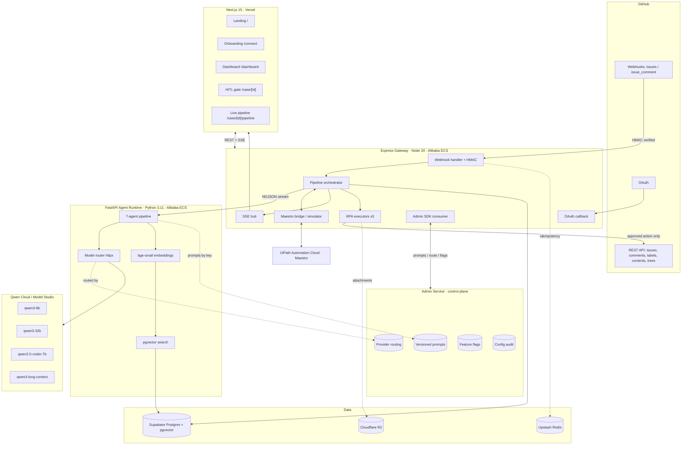
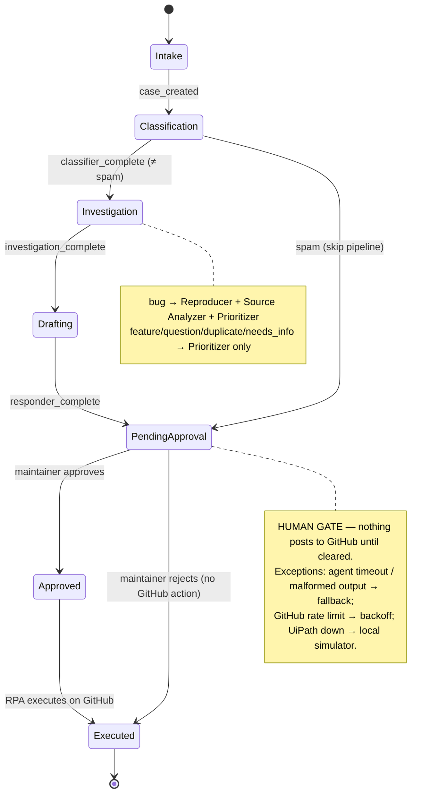
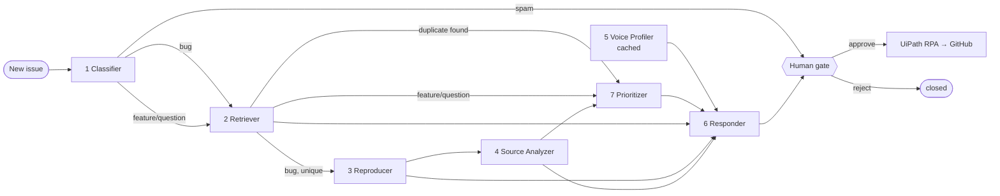

# Helmsman — Architecture

Three diagrams: the full system, the Maestro Case stage machine, and the
multi-agent message-passing flow. These are mirrored in the main README.

## 1. Full system



## 2. Maestro Case stage progression



## 3. Multi-agent message-passing flow

Typed message contracts (TypeScript-style; full Pydantic in `apps/agents/app/schemas.py`):

```ts
Classifier   : (Issue) -> { category, confidence, signals }
Retriever    : (Issue, Candidate[]) -> { ranked, likely_duplicate_of }
Reproducer   : (Issue, CodeBlock[]) -> { has_reproduction, environment, confidence }
SourceAnalyzer: (Issue, File[3]) -> { likely_files, hypothesis, relevant_lines }
VoiceProfiler : (Comment[100]) -> VoiceProfile            // cached per repo
Prioritizer  : (Issue, signals) -> { score, recommended_action }
Responder    : (VoiceProfile, all upstream) -> { draft_markdown, recommended_action }
```


